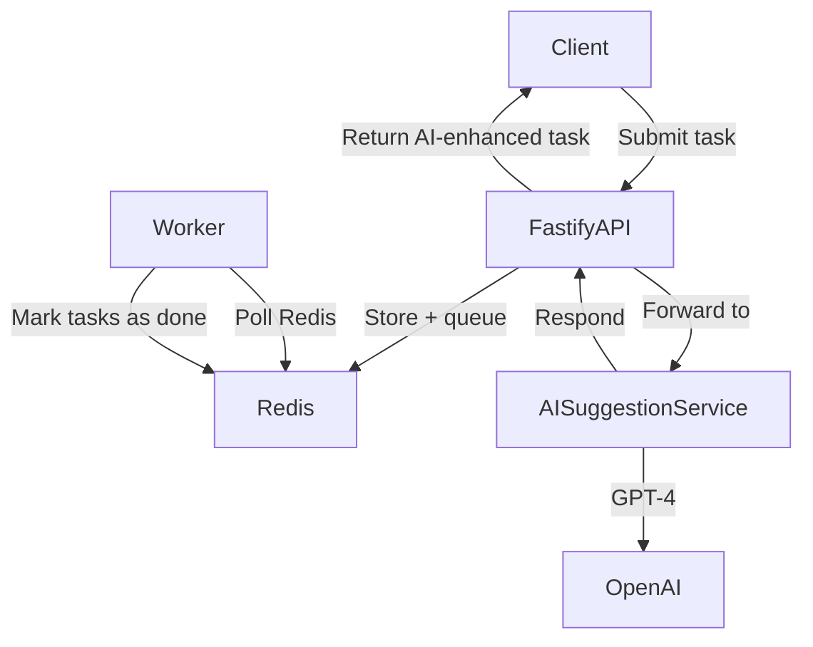

# ZapTask Project 

ZapTask is a lightweight, modular task queue system with AI-enhanced task suggestion capabilities. Built as a two-service architecture, it features a **Node.js + Fastify backend** for task management and a **Python + FastAPI microservice** for LLM-powered task title generation and categorization via GPT-4.

This project demonstrates modern backend design principles including:
- Asynchronous processing
- Microservice communication
- Observability (logging, metrics, tracing)
- AI integration (OpenAI GPT-4)

---

##  Project Structure

```
zaptask-project/
├── node-service/        # Fastify API + Redis + Background Worker
│   ├── routes/
│   ├── worker/
│   └── ...
├── ai-service/          # FastAPI microservice (Python)
│   ├── app/
│   ├── .env
│   └── ...
├── README.md            # Root-level overview (this file)
└── ...
```

---

##  Tech Overview

| Feature                 | Tech Stack                                      |
|-------------------------|--------------------------------------------------|
| Task API                | Node.js (ESM), Fastify, Redis, ioredis          |
| Background Processing   | Node.js worker + Redis TTL                      |
| AI Suggestion Engine    | Python, FastAPI, OpenAI GPT-4, Pydantic         |
| Observability           | Prometheus, Fastify built-in structured logging |
| Traceability            | Trace ID propagation across services            |
| Config Management       | dotenv, .env files                              |

---

##  Service Interaction



---

##  Getting Started (Mono Repo)

### 1. Clone the repository

```bash
git clone https://github.com/hamzatahir9466/zaptask-api.git
cd zaptask-api
```

### 2. Setup Node.js service

```bash
cd node-service
cp .env.example .env
npm install
npm run dev:api
```

Start the worker in a new terminal:
```bash

npm run dev:worker
```

### 3. Setup Python AI service

```bash
cd ../ai-service
python -m venv venv
source venv/bin/activate  # Windows: venv\Scripts\activate
pip install -r requirements.txt
cp .env.example .env
uvicorn app.main:app --reload
```

---

##  Observability

- **Logging**: Fastify built-in structured logging (Pino-compatible)
- **Metrics**: Prometheus endpoint available at `/metrics`
- **Trace ID**: Injected via Fastify hooks and propagated to Python service

---

##  Roadmap

- [ ] API authentication for external clients
- [ ] Rate limiting and retries
- [ ] Vector-based task deduplication (future LLM upgrade)
- [ ] CI/CD for multi-service deployment

---

## License

This is a personal portfolio project for educational and demonstration purposes.
All AI usage must comply with [OpenAI's terms](https://openai.com/policies/usage-policies).
